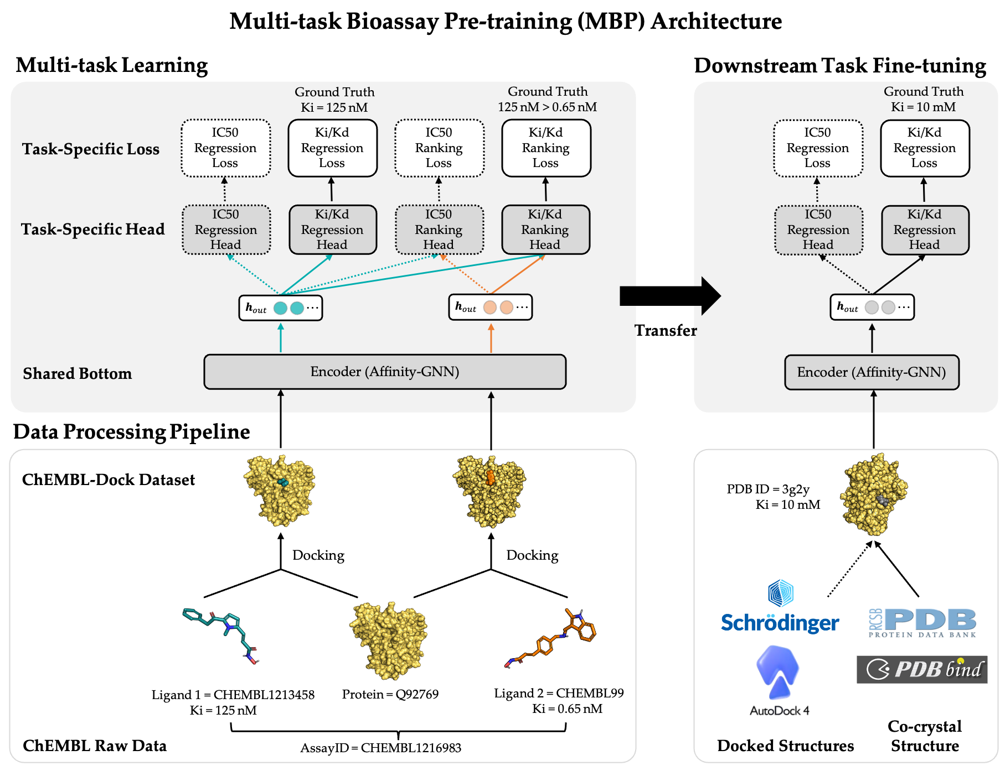

# MBP
MBP: Multi-task Bioassay Pre-training for Protein-Ligand Binding Affinity Prediction

This is a PyTorch implementation of MBP for the task of predicting protein-ligand binding affinity.



## Installation
We provide a script **conda_env.sh** that makes it easy to install the dependencies of MBP. You just need to modify several packages according to you cuda version.
```
conda create -y -n torch_geo python=3.7
conda activate torch_geo
bash conda_env.sh
```

## Dataset
### Pre-training Dataset: ChEMBL-Dock
[ChEMBL-Dock](./ChEMBLDock) is a protein-ligand affinity dataset built based on ChEMBL. 
It consists of protein-ligand binding affinity data from 505,579 experimental measurements in 51,907 bioassays.
The dataset includes 2,121 proteins, 276,211 molecules, and 7,963,020 3D binding conformations.
(MBP only utilizes a small portion of the data in the paper.)

If you want to pre-train our models with processed ChEMBL-Dock data then:
1. download the pre-training dataset ChEMBL-Dock from [Google Drive](https://drive.google.com/file/d/1qX-xm5TjbQQdTIYupgx5JkRGmLPN-I6p/view?usp=share_link)
2. unzip the directory and place it into `MBP/MBP/data` such that you have the path `MBP/MBP/data/chembl_in_pdbbind_smina`

### Downstream dataset: PDBbind v2016 and CSAR-HIQ
If you want fine-tune our models with PDBbind then:
1. download the fine-tune dataset PDBbind v2016 from [PDBbind](http://www.pdbbind.org.cn/).
2. unzip the directory and place it into `MBP/MBP/data` such that you have the path `MBP/MBP/data/pdbbind2016_finetune`

If you want test our models with CSAR-HIQ then:
1. download the independent dataset CSAR-HIQ from [Google Drive](https://drive.google.com/file/d/1NGhylymFfNDLWiLuGBRFtO6U-JfhNmyG/view?usp=share_link)
2. unzip the directory and place it into `MBP/MBP/data` such that you have the path `MBP/MBP/data/csar_test`


## Using the provided model weights for evaluation
### Overall performance on PDBbind and CSAR-HiQ
```
cp scripts/result_reproduce.py ./
python3 result_reproduce.py --work_dir=workdir/finetune/pdbbind
```

### Performance on Transformer-M setting
```
cp scripts/result_reproduce.py ./
python3 result_reproduce.py --work_dir=workdir/finetune/transformer_m
```

### Performance on TANKbind setting
1. download the TANKbind dataset PDBbind v2020 from [PDBbind](http://www.pdbbind.org.cn/).
2. place it into `MBP/MBP/data` and rename it as `pdbbind2020_finetune` such that you have the path `MBP/MBP/data/pdbbind2020_finetune`

```
cp scripts/result_reproduce.py ./
python3 result_reproduce.py --work_dir=workdir/finetune/tankbind
```

## Retraining MBP
### Pre-training on ChEMBL-Dock with MBP
```
# training with single GPU
cp scripts/pretrain.py ./
python3 pretrain.py --config_path=config/affinity_default.yaml

# DDP training with 4-GPUs
# we advise initiating the process by executing the pretrain.py script.
# the pretrain.py will facilitate the preparation of the dataset, thereby ensuring it is ready for subsequent DDP training.
cp scripts/pretrain_ddp.py ./
CUDA_VISIBLE_DEVICES="0,1,2,3" python3 -m torch.distributed.launch --nproc_per_node=4 pretrain_ddp.py --config_path=config/affinity_default.yaml
```

### Fine-tuning on PDBbind and testing on CSAR-HIQ
After obtaining pretrained model, you should replace the value of `test.now` parameter in line 66 of `affinity_default.yaml` as the logging dir for finetuning, then:
```
cp scripts/finetune.py ./
python3 finetune.py --config_path=config/affinity_default.yaml
```

