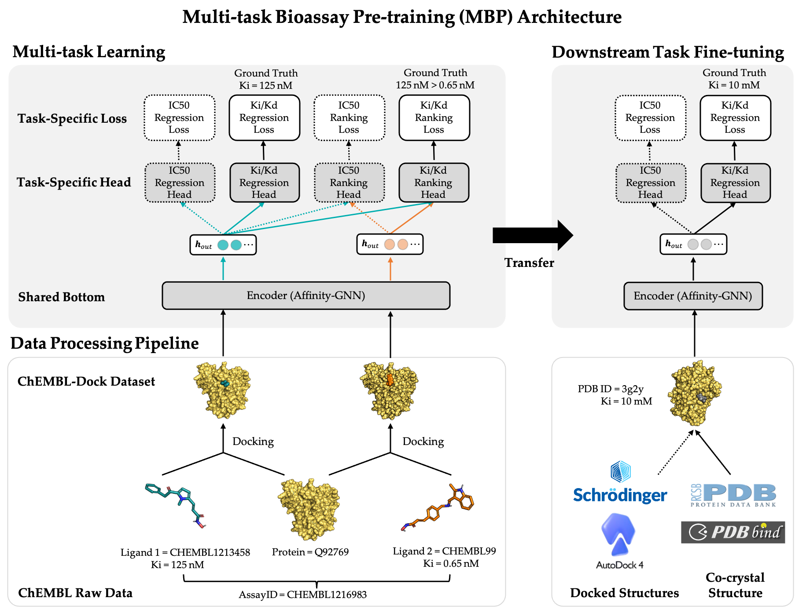

# MBP
This is a PyTorch implementation of MBP for the task of predicting protein-ligand binding affinity.



## Installation
We provide a script **conda_env.sh** that makes it easy to install these dependencies. You just need to modify several packages according to you cuda version.
```
conda create -y -n torch_geo python=3.7
conda activate torch_geo
bash conda_env.sh
```

## Dataset
### Pre-training Dataset: ChEMBL-Dock
If you want to pre-train our models with ChEMBL-Dock then:
1. download the pre-training dataset ChEMBL-Dock from [Google Drive](https://drive.google.com/file/d/1qX-xm5TjbQQdTIYupgx5JkRGmLPN-I6p/view?usp=share_link)
2. unzip the directory and place it into `MBP/data` such that you have the path `MBP/data/chembl_in_pdbbind_smina`

### Downstream dataset: PDBbind v2016 and CSAR-HIQ
If you want fine-tune our models with PDBbind then:
1. download the fine-tune datase PDBbind v2016 from [PDBbind](http://www.pdbbind.org.cn/).
2. unzip the directory and place it into `MBP/data` such that you have the path `MBP/data/pdbbind2016_finetune`

If you want test our models with CSAR-HIQ then:
1. download the independent dataset CSAR-HIQ from [Google](https://drive.google.com/file/d/1NGhylymFfNDLWiLuGBRFtO6U-JfhNmyG/view?usp=share_link)
2. unzip the directory and place it into `MBP/data` such that you have the path `MBP/data/csar_test`

## Pre-training and fine-tuning
### Pre-training on ChEMBL-Dock with MBP
```
cp scripts/pretrain.py ./
python3 pretrain.py --config_path=config/affinity_default.yaml
```

### Fine-tuning on PDBbind and testing on CSAR-HIQ
```
cp scripts/finetune.py ./
python3 finetune.py --config_path=config/affinity_default.yaml
```

